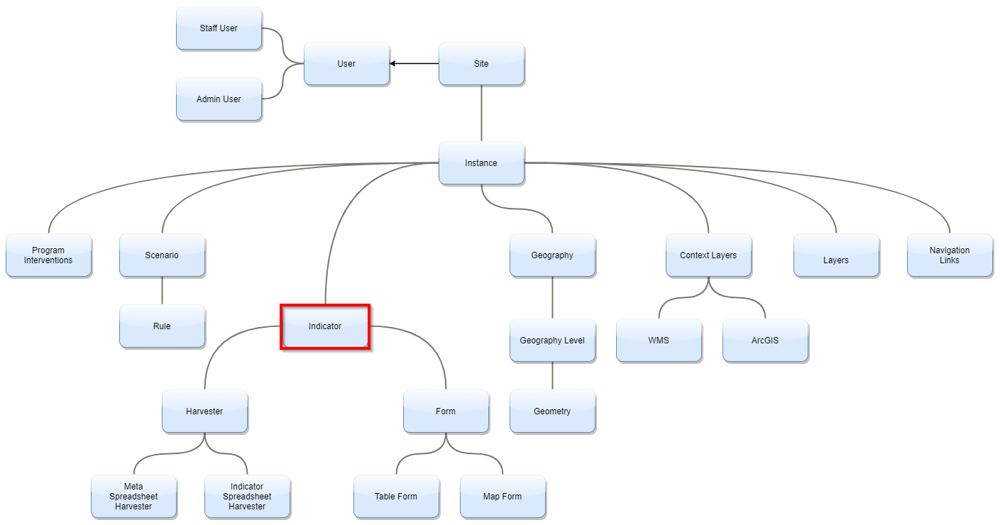
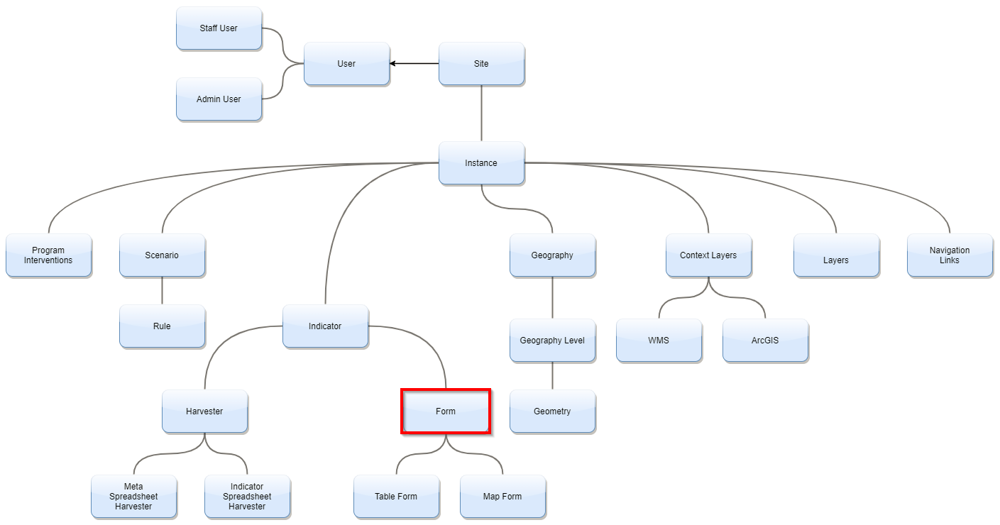
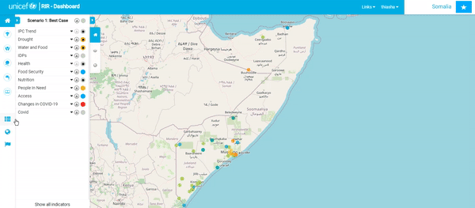
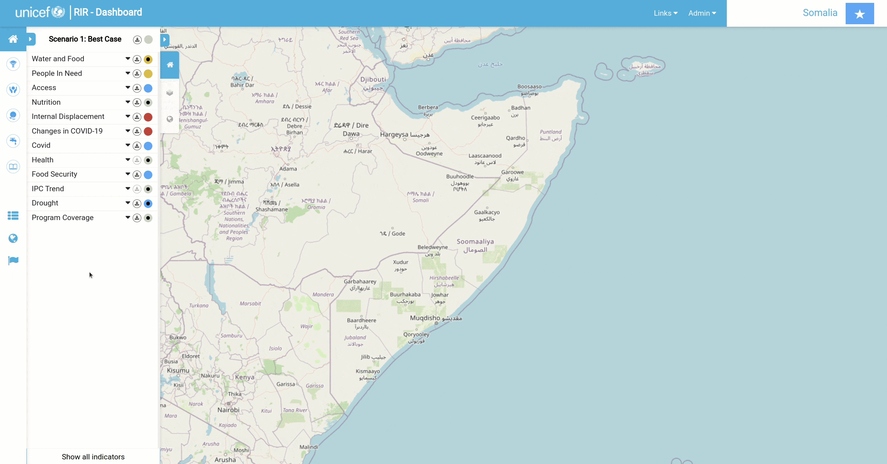
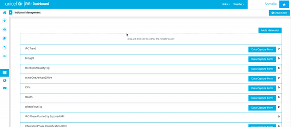

# **Indicators**

 
>
>
1.	**Adding a New Indicator**:
To add an indicator, “click” on ‘Indicator Management’ and go to ‘Create New'. Fill in the necessary information about the indicator you would like to create. 
Once you have filled out the form, "scroll down" to 'Scenario Rules' and add the parameters to match the indicator. you can also change the colour for each rule
by clicking on the colour block. "Click" 'Submit' once you are happy with the added information and scenario rules. If you add a dashbord link, you will see 
a black dot in the centre of the cirlce that represents the scenario case on that indicator in the 'Program Interventions' panel. By clicking on the black dot,
you will be redirected to the dashboard link. 
>
 
>
>
 
>
>
2.	**Value Manager Form**:
>
There are two ways to add data to indicators. The first is by using the 'Value Manager Form'. To access this form, go to 'Indicator Management' and 
"scroll" to the indicator that you would like to add data to. On the right-hand side of the indicator's name, there will be a small 'Settings' symbol.
"Click on 'Settings' for the desired indicator and then "click" on 'Value Manager Form'. You will be redirected to a form that gives you all the geographic 
locations within the instant and spaces to add values. You can also add a file to fill in the data by clicking 'Use File to Refill Form'
>

 
>
>
3. **Value Manager Map**:
>
The second way to add data to an indicator is through the 'Value Manager Map' option. Go to 'Indicator Management' and "scroll" to the indicator that you would
like to add data to. On the right-hand side of the indicator's name, there will be a small 'Settings' symbol. "Click on 'Settings' for the desired indicator and
then "click" on 'Value Manager  Map'. This will take you back to the map canvas. Now you will be able to "click" on any geographic location within the instant 
and a popup window will appear which will allow you to fill in value data for that location. 
>

>
>
 
>
>
4.	**Harvesters**:
>
The process of creating a harvester is for the total automation fetching of data. "G"o to 'Indicator Management' and if you haven't already created the indicator you want to work with, start by doing that. Once the necessary indicator exists, 
"click" on the little 'Settings' icon on the right-hand side of the indicator name. "Select" the 'Create Harvester' option. "Pick" the type of harvester you would
like to create from the drop-down 'Harvester' (you will be presented with three options:'API With Geogrphay Using Today's Date'; API With Geography And Date; and 
'Harvested Using Exposed API By External Client'). For the first two options, "fill" in the 'Attributes' portion of the form and then a popup window with a list of 
keys will appear; "drag" the green labels to their corresponding criteria. Double-check that in 'Geometry Mapping', 'From' matches 'To. "Select" 'Harvest Now'. You can 
"scroll" down to the log to see if your harvest is running in the background. Go to 'Indicator Management' and "click" on the little settings icon that you just 
created a harvester for and "select" 'Value Manager Map' to view your progress. 
>
 
>
>
To create a 'Meta Harvester', go to 'Indicator Management' and in the top right-hand corner of the page, there will be a 'Meta Harvester' option that you will 
need to "select". "fill" in 'Sheet name', Column name: administration code', and add the appropriate file. "Submit" your work. "Click" 'Report File' to view your work.

 
>
>
