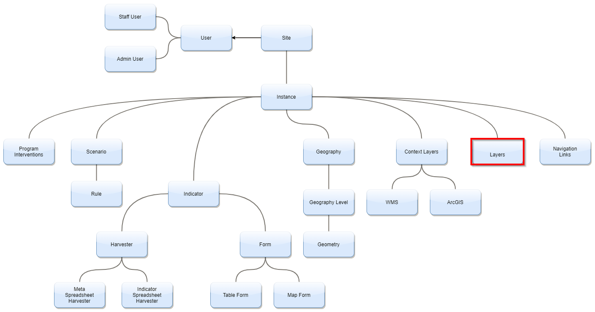
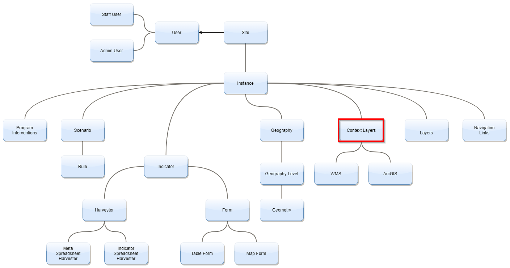
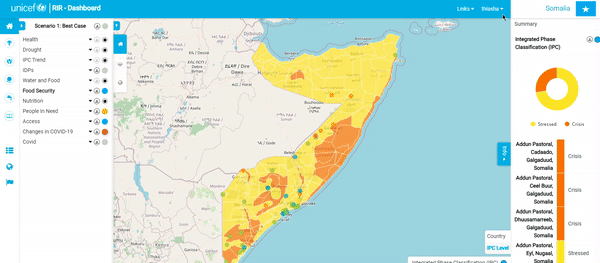

# **Layers**

 
>
>
1.	**Adding a Basemap Layer**:
To add a basemap layer, “click” on ‘Django Admin’ and go to the ‘Site Administration page. “Click” on ‘+Add’ in the ‘Basemap Layers’ row. This will allow you
to create a basemap by linking it to a URL as well as the instant you would like it to apply to. 
>
 
>
>
You will also be able to add the parameters to the basemap by scrolling down to ‘Basemap Layer Parameters’ and clicking on the green plus that says ‘Add Another 
Basemap Layer Parameter’.
> 
 
>
>
 
>

2. **Adding a new Context layer**

"Click" on the user dropdown menu and open 'Django Admin'. "Click" on '+Add' on the 'Context layers' line. "Select" the instance you would like to add the context layer to.
We will use the existing Somalia instance and Flood Hazard layer as an example. The layer shows areas that are prone to flooding. Enter information in the input boxes as 
shown in the images below and save your data once you are happy with it. "Click" on veiw site to see your new layer. You will be able to see your new layer in the 'Layers' menu. There is also an option to add other parameters to this layer. 

>

>

