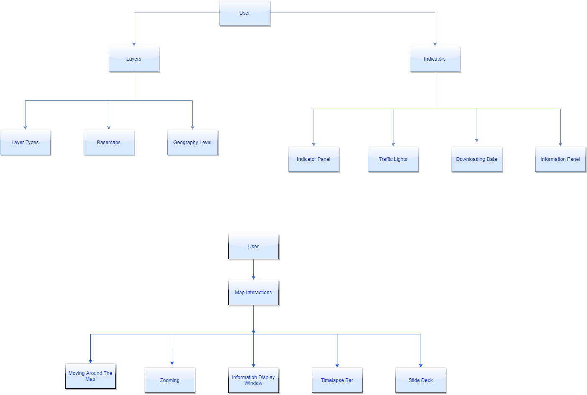

# User Showcase    
The RIR platform is a situational awareness platform to monitor health, child protection, nutrition, water, sanitation and hygiene as well as education in a geographic region. To fully understand the platform and the information you can obtain from it, you need to understand how it works.    
## Session outline    
In this session, we will tour the RIR platform functionality using simple examples and workflows that would be used by the everyday platform user.
### Important Links:    
[RIR Platform](https://staging.rir.kartoza.com/ "RIR Platform")  
[RIR Full Documentation](https://kartoza.github.io/rir-dashboard/pages/introduction.html/ "RIR Full Documentation")     
### Session breakdown diagram:    
   
## Platform Tour    
In the section we will be shown how to navigate the platform, where all the information is and be given a summary of what each tool and button does including simple examples and workflows(Full documentation here: [Platform Tour](https://kartoza.github.io/rir-dashboard/pages/using/platform_tour.html)).   
### The live demonstration includes the following: 
1. Access and log in to the platform  
2. Programme Interventions Panel: This group of buttons is used to navigate through the key areas of factors or indicators that the RIR platform accounts for.  
3. The Indicator Panel: This panel contains a list of indicators that relate to the factors accounted for by the platform. (Full documentation here: [Indicators](https://kartoza.github.io/rir-dashboard/pages/using/indicators.html#indicators))  
4. The Indicator Icon: This button expands and collapses the indicator panel if the button is in blue as illustrated in the image below.  
5. Layers (Full documentation here: [Layers](https://kartoza.github.io/rir-dashboard/pages/using/layers.html#layers))  
◦            The Layers Icon   
◦           The Basemap Icon  
◦           Geography Level Panel: This panel allows you to view the area of interest at a country, region, and district geography level.  
6. Map: (Full documentation here: [Map Interactions](https://kartoza.github.io/rir-dashboard/pages/using/map_interactions.html))  
◦           Panning/ moving around the map  
◦           Zooming in and out  
◦           The information display window  
◦           Slide deck (eg. people in need of 'Child Protection' vs. 'Child Protection Program Coverage')  
◦           Timelaps (eg. IDP arrival over time)  
7. The Info Button  
8. Graphical Representation  
9. Links Button: If you “click” on the “links” button, a dropdown menu appears. These are the various links to the different servers that the RIR platform connects to.    
 User Documentation [**Here**](https://kartoza.github.io/rir-dashboard/pages/using/index.html/ "**Here**")  
