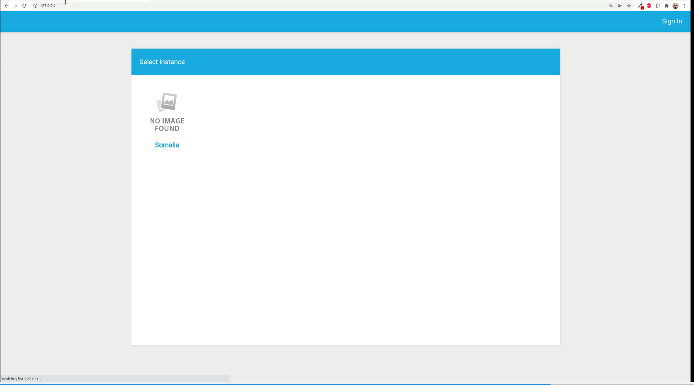
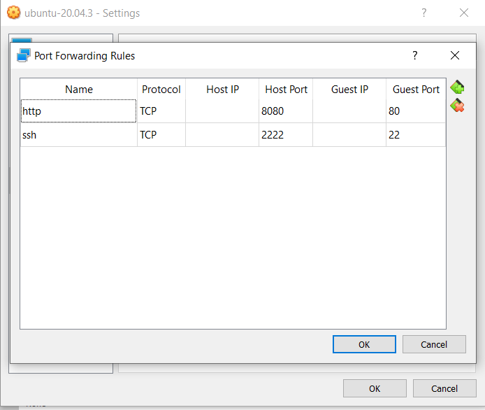
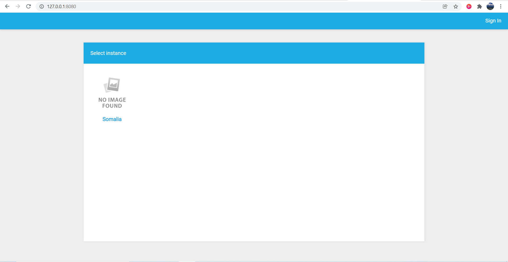

# Setting Up the Project

## Clone rir-dashboard repository to your machine

This will clone the rir-dashboard rpository to your machine or virtual box
```
git clone https://github.com/kartoza/rir-dashboard.git
```

## Set up the project

This will set up the rir-dashboard project on your machine
```
cd rir-dashboard
cd deployment
cp docker-compose.override.template.yml docker-compose.override.yml
cp .template.env .env
cd ..
make up
```
Wait until everything is done.

After everything is done, open up a web browser and go to [http://127.0.0.1/](http://127.0.0.1/) and the dashboard will open:



By Default, we can use the admin credential:<br>
username : admin<br>
password : admin

## Setup different environment
to setup different environment, for example the Default credential, or the port of server, open **deployment/.env**

```
COMPOSE_PROJECT_NAME=rir_dashboard
NGINX_TAG=0.0.1  -> Change this for different nginx image
DJANGO_TAG=0.0.1 -> Change this for different django image
DJANGO_DEV_TAG=0.0.1 -> Change this for different django dev image

# Environments
DJANGO_SETTINGS_MODULE=core.settings.prod -> Change this to use different django config file
ADMIN_USERNAME=admin -> Default admin username 
ADMIN_PASSWORD=admin -> Default admin password
ADMIN_EMAIL=admin@example.com -> Default admin email
INITIAL_FIXTURES=True
HTTP_PORT=80 -> Change the port of nginx

# Database Environment
DATABASE_NAME=django -> Default database name
DATABASE_USERNAME=docker -> Default database username
DATABASE_PASSWORD=docker -> Default database password
DATABASE_HOST=db -> Default database host. Change this if you use cloud database or any new docker container.
RABBITMQ_HOST=rabbitmq

# Onedrive
PUID=1000
PGID=1000
```

Change the desired variable and do `make up`. It will rerun the project with new environment.

## For using virtual box

Open network settings of your virtual box


Click on port forwarding and add 2 new rules as indicated in the image below:



Click OK and close. Download [PuTTY](http://www.chiark.greenend.org.uk/~sgtatham/putty/latest.html).
Create a connection by following these [directions](https://the.earth.li/~sgtatham/putty/0.67/htmldoc/Chapter2.html#gs-insecure), enter “localhost” as the host name, “SSH” as the protocol, and “2222” as the port.

Once you have logged in on PuTTY enter this command below in the prompt: 
```
ssh yourlogin@127.0.0.1 -p 22
```
(Make sure that you replace your username with "yourlogin")

When asked for your password, press enter three times and the prompt will display this message:  Permission denied (publickey,password).
 

Open the RIR dashboard server using a web browser on your machine by going to 127.0.0.1:8080

