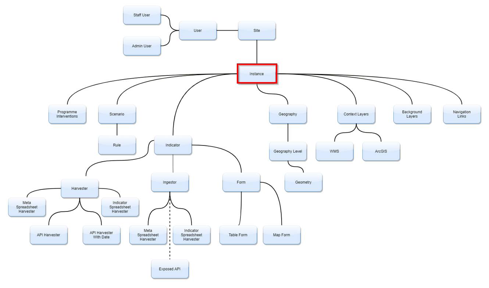
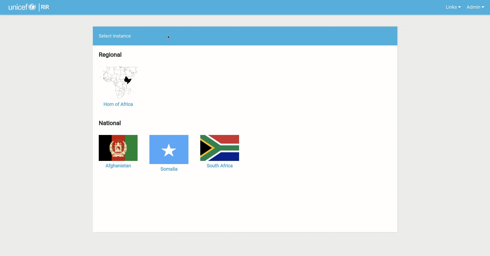
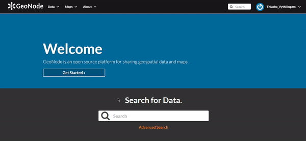
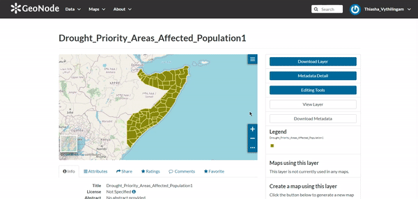
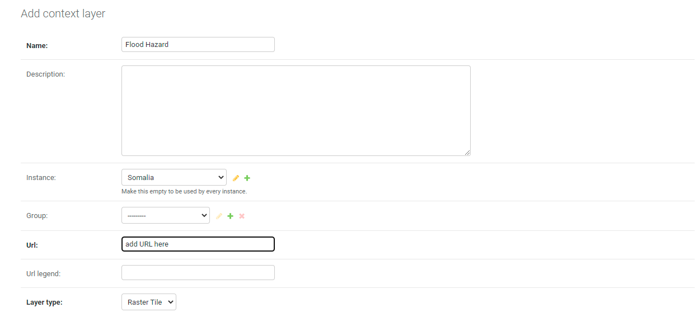
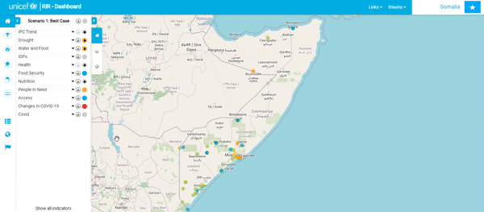

# Administrator Tutorial

## Introduction 
The RIR platform is a situational awareness platform to monitor health, child protection, nutrition wash and education in a geographic region. To fully understand the platform and the information you can obtain from it, you need to understand how it works.    

## Important Links
[RIR Platform](https://staging.rir.kartoza.com/ "RIR Platform")  
[RIR Full Documentation](https://kartoza.github.io/rir-dashboard/pages/introduction.html "RIR Full Documentation")     

## Session outline
In this session, we will tour the RIR administration functions using examples and workflows that would be used by site administrators.    
   
### Platform Administration:  
•         User Management: Creating and editing user profiles.  
•         Managing Instances: Creating new and editing preexisting instances.  
•        Managing Context Layers: Using layers that you have uploaded to GeoNode or GeoServer to create a context layer in the platform.  
•         Geography management: Adding geography levels to your instance. 
   
 
### Indicator Management:  
 •         Ingestors: Adding data to create indicators for an instance.  
◦  Map  
◦   Form  
◦  Single Upload  
◦   Meta Upload  
 
•         Harvesters: Pulling data from an external source to create indicators for an instance.   

Admin Documentation [**Here**](https://kartoza.github.io/rir-dashboard/pages/administration/index.html "**Here**")    

# Session Tutorial:   
1. **Signing In**:
In the top right-hand corner of the screen is the sign-in button. Here, you will sign in using your admin username and password. This process is the same for a staff user 
and an admin user. 
   

2. **Users and Permissions**:
Go to site administration. “click” on ‘+Add’ in the same row as ‘Users’. You can now create a profile for someone by adding a username and password. Once you have created the user profile, “click” ‘Save’.
   
Once you have created the user account, go back to ‘Site Administration’ and “select” the ‘user’ option. “Select” the user you created and then you can edit their personal information as well as select or deselect their ‘Permissions’. Remember to ‘Save’ your changes. 
  
 
3.  **Creating an instance**: 
Once you’ve signed in, you’ll be redirected back to the home page which contains the various instances that you can select. To create a new Instance, select the
dropdown arrow next to your username and “click” on ‘Django Admin’. Once you’re on the ‘Site Administration’ page, “scroll” down until you find ‘Instances’. 
“Click” on the ‘+Add’ option on the right-hand side of the ‘Instances’ row. “Add” the name of the new instance, a description as well as the icon files 
and then “click” ‘Save’.
   
4.   **Adding a new Context layer**: To add a context layer to the dashboard, you need to push the data from an online server. To do this you will first need to upload the data to GeoNode or GeoServer
as well as a styled layer descriptor file (SLD). Let’s start by creating the SLD in QGIS. Once you’ve opened QGIS or the mapping software of your choice, upload the 
data to your canvas as you would normally do. Once the layers are added, use the ‘Layer Styling’ panel to create an appropriate style for the data. You want to follow
the general theme of the layers that are already on the dashboard. Once you are happy with the style “right-click” on the layer and “select” ‘Properties’. 
Go to ‘Symbology’ and “click” on the drop-down ‘Style’ button. “Select” ‘Save Style’. “Click” on the ‘Save Style’ drop-down option and “select” ‘As SLD Style File’.
“Click” on the ellipse on the right-hand side of the ‘File’ line to choose a place to save the SLD. Do this for each file you want to upload.
       
Now we’re going to upload it to GeoNode. Log into your GeoNode or GeoServer account. “Click” on the ‘Data’ dropdown. “Select” ‘Upload Layer’. Please note that
you can only upload one layer at a time. “Drop” all the data for the layer into the grey box and “select” ‘Upload files’.   
   
Once the data has uploaded, “click” on ‘Edit Metadata’. “Fill” in as much of the metadata information as you have and then “click” ‘Return to Layer’.  
    
“Click” on ‘Editing Tools’. “Click” on ‘Upload’ under ‘Styles’. “Choose” your SLD file and then return to layer once again. In ‘Editing tools’ you can also
change the thumbnail for the layer by uploading a screenshot of the layer.  
   
“Right-click” on the layer and “Select” ‘Inspect’. “Select” ‘Network’ and hard refresh the page. “Select" the web address for a tile from the layer
(usually the third option) but if you click on the address, you’ll be able to see if it is the right one).  
    
Copy the link address and paste it into a notepad and change all the words in full capital letters to lower case letters. Use this edited link address as the URL when adding a new layer.   
"Click" on the user dropdown menu and open 'Django Admin'. "Click" on '+Add' on the 'Context layers' line. "Select" the instance you would like to add the context layer to.
We will use the existing Somalia instance and Flood Hazard layer as an example. The layer shows areas that are prone to flooding. Enter information in the input boxes as 
shown in the images below and save your data once you are happy with it. "Click" on veiw site to see your new layer. You will be able to see your new layer in the 'Layers' menu. There is also an option to add other parameters to this layer. 
  

5. **Adding a Geography level**: Let’s start in  ‘Site Administration’. “Scroll” down to ‘Geometry Level Instances’ and “select” ‘+Add’. “Add” the name and description to your instance. Go back to the main page of your instance. Below the ‘Program Interventions’ panel are three icons; ‘Indicator Management’, ‘Geography Management’, and ‘Instance Management’. 
	  	 “Click” on the ‘Geography Management’ icon. You will be redirected to the ‘Geography View’ map page and you will see that in the top right corner there is an '+uploader' button. "Select" this button and start filling in the form. The first thing you need to do is "add" the data for the geography level. Once the data is uploaded, you will be able to fill in the rest of the form.  Please note that the country level does not have a parent level.   
6.	**Adding a New Indicator**:
To add an indicator, “click” on ‘Indicator Management’ and go to ‘Create New'. Fill in the necessary information about the indicator you would like to create. 
Once you have filled out the form, "scroll down" to 'Scenario Rules' and add the parameters to match the indicator. you can also change the colour for each rule
by clicking on the colour block. "Click" 'Submit' once you are happy with the added information and scenario rules. If you add a dashbord link, you will see 
a black dot in the centre of the cirlce that represents the scenario case on that indicator in the 'Program Interventions' panel. By clicking on the black dot,
you will be redirected to the dashboard link. 
  

7.	**Value Manager Form**:
There are two ways to manually add data to indicators. The first is by using the 'Value Manager Form'. To access this form, go to 'Indicator Management' and 
"scroll" to the indicator that you would like to add data to. On the right-hand side of the indicator's name, there will be a small 'Settings' symbol.
"Click on 'Settings' for the desired indicator and then "click" on 'Value Manager Form'. You will be redirected to a form that gives you all the geographic 
locations within the instantce and spaces to add values. You can also add a file to fill in the data by clicking 'Use File to Refill Form'
   

8. **Value Manager Map**:
The second way to add data to an indicator is through the 'Value Manager Map' option. Go to 'Indicator Management' and "scroll" to the indicator that you would
like to add data to. On the right-hand side of the indicator's name, there will be a small 'Settings' symbol. "Click on 'Settings' for the desired indicator and
then "click" on 'Value Manager  Map'. This will take you back to the map canvas. Now you will be able to "click" on any geographic location within the instantce 
and a popup window will appear which will allow you to fill in value data for that location.
  

9.	**Harvesters**:
The process of creating a harvester is for the total automation fetching of data. Go to 'Indicator Management' and if you haven't already created the indicator you want to work with, start by doing that. Once the necessary indicator exists, 
"click" on the little 'Settings' icon on the right-hand side of the indicator name. "Select" the 'Create Harvester' option. "Pick" the type of harvester you would
like to create from the drop-down 'Harvester' (you will be presented with three options: 'API With Geogrphay Using Today's Date'; 'API With Geography And Date'; and 
'Harvested Using Exposed API By External Client'). The first two options are for the harvester and the third one is for the ingestor. For the 'API With Geogrphay Using Today's Date' and 'API With Geography And Date' options,  "fill" in the 'Attributes' portion of the form and then a popup window with a list of 
keys will appear; "drag" the green labels to their corresponding criteria. Double-check that in 'Geometry Mapping', 'From' matches 'To. "Select" 'Harvest Now'. You can 
"scroll" down to the log to see if your harvest is running in the background. Go to 'Indicator Management' and "click" on the little settings icon that you just 
created a harvester for and "select" 'Value Manager Map' to view your progress.
   
To create a 'Meta Harvester', go to 'Indicator Management' and in the top right-hand corner of the page, there will be a 'Meta Harvester' option that you will 
need to "select". "fill" in 'Sheet name', 'Column name: administration code', and add the appropriate file. "Submit" your work. "Click" 'Report File' to view your work.
   

10.	**Ingestors**:
The function of an ingestor is to manually upload data which is then automatically ingested or pushed from a remote side. To start, "click" on 'Create Harvester"
as you did for the harvester options. "change" the type of harvester to 'Harvested using exposed API by external client'. "Add" necessary notes and "submit".
You will now be presented with an 'API URL' and a 'Token' that has been received from an external source. You now need to "push" the data from outside to the RIR 
dashboard. "Open" the API platform that you use to build and use API's. We used Postman. "Copy" over the URL and token to push the data to the RIR dashboard.
  

