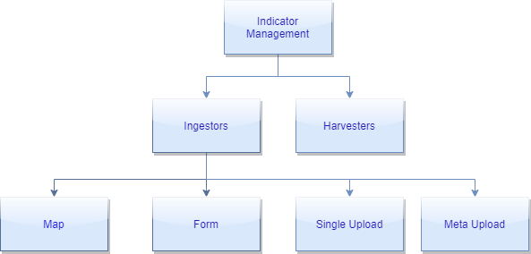

# Administrator Tutorial

## Introduction 
The RIR platform is a situational awareness platform to monitor health, child protection, nutrition wash and education in a geographic region. To fully understand the platform and the information you can obtain from it, you need to understand how it works.    

## Important Links
[RIR Platform](https://staging.rir.kartoza.com/ "RIR Platform")  
[RIR Full Documentation](https://kartoza.github.io/rir-dashboard/pages/introduction.html "RIR Full Documentation")     

## Session outline
In this session, we will tour the RIR administration functions using examples and workflows that would be used by site administers.    
   
### Platform Administration:  
•         User Management: Creating and editing user profiles.  
•         Managing Instances: Creating new and editing preexisting instances.  
•        Managing Context Layers: Using layers that you have uploaded to GeoNode or GeoServer to create a context layer in the platform.  
•         Geography management: Adding geography levels to your instance. 
   
 
### Indicator Management:  
 •         Ingestors: Adding data to create indicators for an instance.  
◦  Map  
◦   Form  
◦  Single Upload  
◦   Meta Upload  
 
•         Harvesters: Pulling data from an external source to create indicators for an instance.   

Admin Documentation [**Here**](https://kartoza.github.io/rir-dashboard/pages/administration/index.html "**Here**")  

