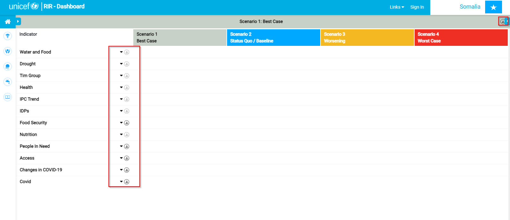

#Indicators

The RIR dashboard displays various indicators and their corresponding severity levels in the indicator panel. This panel can be accessed under the indicators tab
which is visible when the user has selected the context analysis icon which is located above the Programme interventions bar. Each indicator falls under health,
child protection, nutrition, wash and education. The severity levels refer to how good or bad the case is for that factor within the instant. This ranges from worst 
case scenario to best case scenario. The case of the scenario will indicate if that region or state needs additional response or intervention. 

To show the data for specific indicators on the map, select the box of the corresponding indicator. To stop showing the data of that indicator, deselect the box.

1.	**Indicators**:
The indicators in the panel are divided up into groups. Each group has a drop-down arrow that contains subgroups. This allows the user to access data for each indicator group or allows them to be more specific and only select data to be displayed from a subgroup within the indicator.

2. **Traffic lights**: 
To view the traffic lights, expand the indicators panel by clicking on the arrow for ‘full screen’ as indicated in the clip below. This will change your screen completely
and allow to look at the severity level for each indicator. In order to view each subsection in each group, expand the indicator group. The severity levels displayed 
are for the entire instant, in this case they show the indicators and their corresponding severities for Somalia.

3. **Downloading Data**:
It is possible for the user to download data for each indicator or even for the whole instant. The download option is next to each indicator on the Traffic Light screen
and the option to download data for the entire instant is on the top right corner of the screen. The data will download in the form of an excel spreadsheet.
Downloading data for the entire instant will provide the user country, region, district and IPC level data for the geographic location under observation.

4.	**The info panel**:                                    
The information panel is located on the righthand side of the screen. It’s only visible when an indicator is selected in the indicator panel. 

The panel shows the severity case of the selected indicator in each region or district (depending on what has been selected). It also has a graphical representation
in the form of a pie chart that displays how many areas within the instant fall within each severity case. By dragging the mouseover the pie chart,
the use can see these values. The user can also download the data for that specific indicator in the info panel. The download icon is circled in red in the image below. 

To view the severity levels of each indicator for a specific location, click on a region or district on the map. This should create a pop-up window on the screen
as previously discussed in the Map Interactions document. It should also create a tab in the info panel called Indicators.

