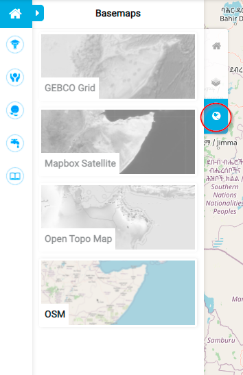
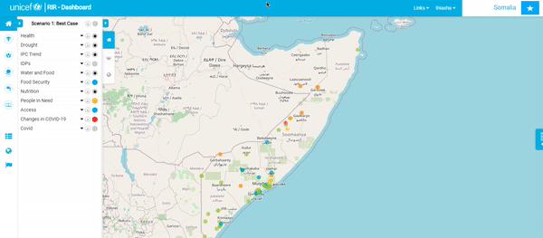

# Layers
>
A layer represents geographic data that can be represented on a map as either a point, line, or polygon. A layer could be a particular theme of data. 
Examples of a map layers could include roads, political boundaries, Covid hotspots, schools or even orthophoto imagery. Each layer is a visual representation of a dataset.
>
1.	**Layers Tab**
Underneath the indicators tab is the layers tab. By clicking on this, the user opens a display of different layers that they can activate to be displayed on the map canvas.
>

>
The Layers show on the map canvas above the indicators. If the layer activated is a polygon layer, the user won’t be able to see which indicators are active 
and therefore needs to switch between layers and indicators. 
>
 
>
>
2.	**Basemap Tab**
A basemap provides background detail necessary to orient the location of the map as well as other geographic phenomena such as topography or boundaries for example. 
Additionally, basemaps contribute to the aesthetic of a map. Below the layers tab is the Basemap tab. If you click on this tab, a selection of various
basemaps will be displayed for you as the user to choose from.
>

>
The default basemap that’s on the map canvas is OSM which is ‘open street map’. There is also a GEBCO grid basemap which is a global terrain model for ocean 
and land, a mapbox satellite basemap and an open topo basemap which is rendered from OSM and SRTM data.
>
 
>
>
3.	 **Geography level panel**:
This panel allows you to view the area of interest at a country, region, and district level. In the animated image below, you will see that as you change
the geography level, the data in the info tab will also change to correspond with it. 
>
 
>
>

