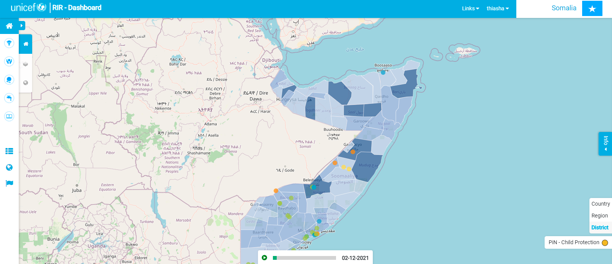
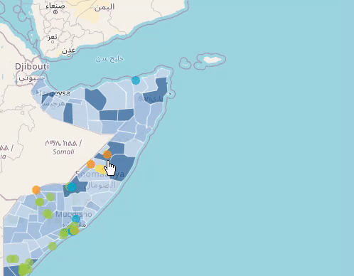
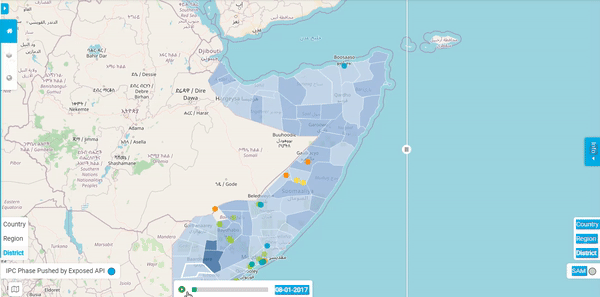

# Map Interactions

This document covers how you can interact with the map displayed in the RIR dashboard and how the user can navigate around to perform different functions
and obtain different information. 
>

>
>
1. **Moving Around the Map**:
To pan around the map, you need to click down with your mouse and drag the map around. The map will continue to pan for as long as the mouse is clicked in. 
To make the map stop moving, release your mouse.
>

>
>
2.	**Zooming In and Out**:
There are two ways to zoom in and out. The first is that you can use your scroll on their mouse to zoom in and out. This is the easier of the two methods.
The second method can be used when you are looking to zoom into a specific area. This method requires the user to click "shift" and then drag a square around the
area they would like to focus in on. If you are using a scroll pad and not a mouse, you can zoom out by bringing your fingers together on your trackpad and zoom 
out by moving them away from each other on your trackpad.
>

>
>
3.	**Information Display Window**:
To gain instant information on a specific area within the map, click on that area with your mouse. By clicking on an area, a popup window with information 
related to your selected layers for that area will be displayed on the screen. This action will also change the info window in the ‘summary’ tab
to the  ‘indicators’ tab. You can also view more details by clicking on ‘details’ in the popup window. This will also change the info window’s tab to the ‘details’ tab.
>

>
>
4.	**The Slide Deck**: 
  If you have two factors selected to display on the map at the same time, you will see the name and severity levels on the bottom right and left of the screen.
  To move between the two sets of data drag the vertical line, that extends from the top of the screen to the bottom, left to right. This feature allows 
  the user to analyse more than one indicator at a time without having to deselect and select another factor.
>

>
  By clicking on the little map icon at the bottom left of the screen, you can change the slide deck function from vertical to horizontal. 
>

>
>
5.	 **Timelapse Bar**:
The timelapse bar will show you the severity of the selected indicator over a period of time. As the map and the info panel change, the corresponding date for
that data will be displayed within the bar. To initiate the time-lapse, click on the "play" button. Click "stop" to end it. 
>

>
>	
